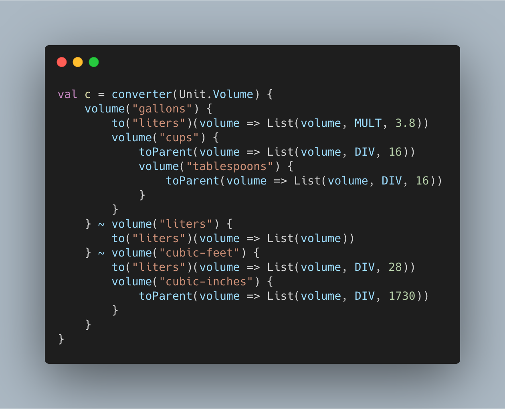

# Converter Project


Project that converts various temperatures and volumes.

## Testing

Check out the project and run `sbt test`.

CI tests run on pushes to master and every pull request.

## Building

Check out the project and run `sbt assembly`.

Now you can run conversion checks:

```
% java -jar target/scala-2.13/converter.jar 100.0 Celsius Fahrenheit 212.0
Correct
% java -jar target/scala-2.13/converter.jar 100.0 Celsius Fahrenheit 213.0
Incorrect
% java -jar target/scala-2.13/converter.jar 100.0 Celsius Fahrenheit xyz
Incorrect
% java -jar target/scala-2.13/converter.jar 100.0 Celsius test 212.0
Invalid
```

## Developing

#### Adding a new Temperature conversion:

1. Create a case object that implements the [Temperature Trait](src/main/scala/converter/Temperature.scala#L3).
1. Add the case object to the [Temperature Object](src/main/scala/converter/Temperature.scala#L8) pattern match.

This trait has two methods that need to be implemented; `toCelsius` and `fromCelsius`.

```
trait Temperature {
  def toCelsius(in: Double): Double
  def fromCelsius(in: Double): Double
}
```

```
object Temperature {
  def valueOf(string: String) = string match {
    case "Kelvin"     => Some(Kelvin)
    case "Celsius"    => Some(Celsius)
    case "Rankine"    => Some(Rankine)
    case "Fahrenheit" => Some(Fahrenheit)
    case _            => None
  }
}
```

#### Adding a new Volume conversion:

1. Create a case object that implements the [Volume Trait](src/main/scala/converter/Volume.scala#L3).
1. Add the case object to the [Volume Object](src/main/scala/converter/Volume.scala#L8) pattern match.

This trait has two methods that need to be implemented; `toLiters` and `fromLiters`.

```
trait Volume {
  def toLiters(in: Double): Double
  def fromLiters(in: Double): Double
}
```

```
object Volume {
  def valueOf(string: String) = string match {
    case "liters"       => Some(Liters)
    case "gallons"      => Some(Gallons)
    case "tablespoons"  => Some(Tablespoons)
    case "cups"         => Some(Cups)
    case "cubic-inches" => Some(CubicInches)
    case "cubic-feet"   => Some(CubicFeet)
    case _              => None
  }
}
```

### Testing Locally

Tests are located in [ConverterSpec](src/test/scala/converter/ConverterSpec.scala).

Please place tests in one of the following three categories:

1. "Converter.convert" should "return Invalid for invalid args"
1. "Converter.convert" should "return Incorrect"
1. "Converter.convert" should "return Correct"

Tests will likely resemble the following format:

```
var result = Converter.convert(Array("100.0", "Celsius", "Fahrenheit", "212.0"))
assert(result === "Correct")
```

> Currently, we allow for answers rounded to the nearest 10th to return `Correct`.

## Cutting a release

To release a new version, we need to create a tag and push it.

> Tag must have v\* in the tag: v0.0.1

```
git tag <tagname>
git push origin <tag>
```

For Example:

```
git tag v0.0.1
git push origin v0.0.1
```

These will be available in the [Releases](https://github.com/duanebester/converter/releases) section.

## Using the latest release

You can go to the [Releases](https://github.com/duanebester/converter/releases) section and download the latest `converter.zip`!

Downloading and unzipping the above, you can grade the `[Target Number]` below:

```
java -jar converter.jar [Input Number] [Input Unit] [Target Unit] [Target Number]
```

#### Examples

```
java -jar converter.jar 100.0 Celsius Fahrenheit 212.0
# Correct
```

```
java -jar converter.jar 100.0 Celsius Fahrenheit 200.0
# Incorrect
```

## Future Considerations

### GraalVM Native

It would be awesome to convert the converter.jar to native for the top 3 platforms; Windows, Linux and macOS.

### Magnet Pattern API

Imagining a world where instead of adding Volume case objects that implement `toLiters` and `fromLiters`. We could instead define a conversion API similar to:


